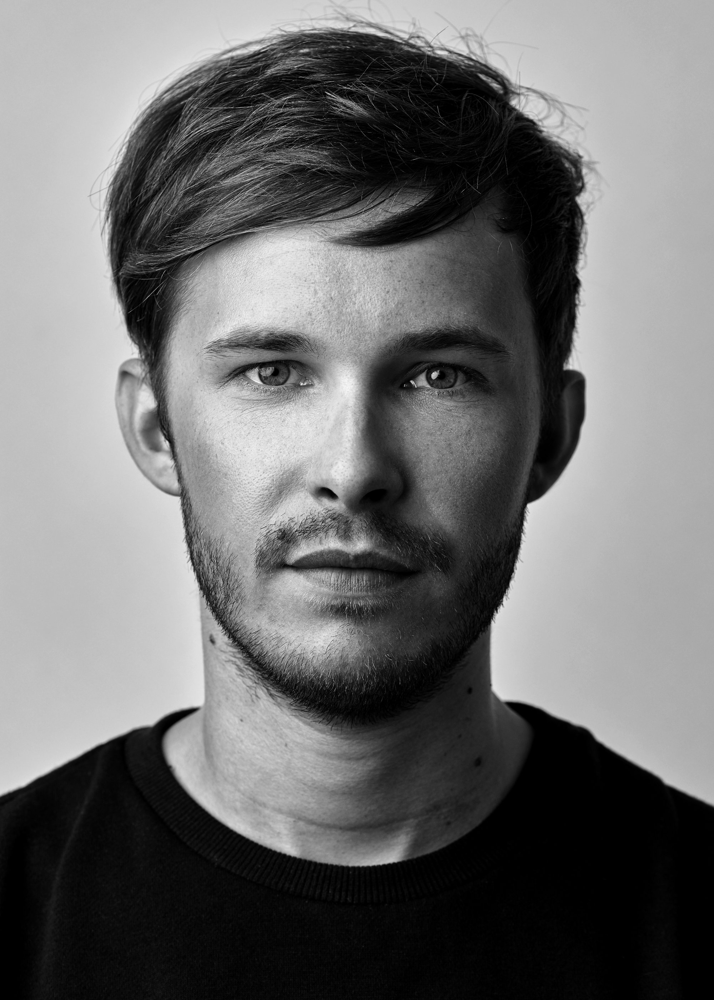

### [Andreas Jäggi (\*1989)](https://jkon.ch)

Andreas Jäggi (\*1989) lebt und arbeitet in Bern und Solothurn. 2017 hat er das Bachelorstudium in Fine Arts an der Zürcher Hochschule der Künste abgeschlossen. Seit 2015 ist Andreas Jäggi in Ausstellungen präsent, unter anderem im Bieler Kunsthaus Pasquart, im Kunstmuseum Olten und der Stadtgalerie Bern. 2018 erhielt er vom Kuratorium für Kulturförderung des Kantons Solothurn den Förderpreis Bildende Kunst.

In seiner künstlerischen Praxis verwendet Jäggi unterschiedliche Medien, Materialien und Formate. Oft handelt es sich um Alltags- und Konsumgegenstände, welche er verfremdet, umdeutet und zu einer Art surrealen Objektkunst verbindet. Inspiriert wird er von gesellschaftlich aktuellen Themen gleichermassen wie von philosophischen und wissenschaftlichen Diskursen.

### [Anina Müller (\*1997)](https://jkon.ch)

Anina Müller, aufgewachsen in Winterthur und Singapur, studiert zurzeit Bildende Kunst an der Hochschule für Gestaltung und Kunst in Basel. Sie schreibt und liest gerne, vor allem über Liebe und Klischees. Sie spricht gern viel und oft auch zu laut und dachte somit, dass sie diese, oft als nervig betrachtete Eigenschaft, zu ihrem Vorteil in ihre Kunst einfliessen lassen sollte. 

Ich befasse mich mit dem Medium der Sprache, sei es in geschriebener oder gesprochener Form. Durch das unkonventionelle Spielen mit der Sprache, dieses in unserem Alltag präsenten und unscheinbares Werkzeug, setze ich sie in den Mittelpunkt und thematisiere somit ihren Einfluss auf uns Menschen. Ich interessiere mich für die Dichotomie des Verstehens und Nichtverstehens, der Gemeinschaft und Einsamkeit, welche die Sprache in sich trägt.

### [Anna Jaun (\*1992)](https://jkon.ch)

Anna Jaun ist freischaffende Künstlerin. Sie lebt und arbeitet in Ins (BE). Nach ihrem Studium Master of Arts in Art Education an der Hochschule der Künste in Bern betreibt sie das kulturforum.be in Erlach und organisiert verschiedene kulturelle Anlässe, darunter auch Ausstellungen. Ihre Werke wurden bereits an verschiedenen Orten im In- und Ausland präsentiert (u.a. an der Cantonale Berne Jura 2019, Pasquart Kunsthaus Centre d’Art).  

Anna Jauns Arbeiten bewegen sich zwischen Figuration und Abstraktion. In kurzen und intensiven Momenten entstehen Bilder, in denen Erinnerungen, Geschichten, Gefühle oder Vorstellungen ihren Ausdruck finden. Sie erzählt von humorvollen Begegnungen, bei welchen die bildliche und materielle Körperlichkeit im Zentrum stehen. Diese wird spürbar im gewählten Material, in der ungrundierten Baumwolle und im lustvollen Auftragen der Farbe. 

### [Christina Huber (\*1988 Landshut, Deutschland)](https://jkon.ch)

Christina Huber lebt und arbeitet in Zürich. Sie studiert seit 2014 Bildende Kunst an der Universität der Künste in Berlin und war 2018 für ein Gaststudium an der Central Saint Martins University of Arts, London. Ihre Arbeiten werden in Ausstellungen in der Schweiz, Deutschland, Polen und Grossbritannien gezeigt.

Christina Huber interessiert sich für den Dialog zwischen unserer Umwelt und menschlicher Handlung. Dabei setzt sie malerische Gesten und verschiedene Oberflächentexturen gegenüber, greift in die Architektur der Ausstellungsräume ein und arbeitet mit diversen technischen Verfahren und Maschinen. In ihren Arbeiten hinterfragt sie die Einbettung unserer Gesellschaft in kulturelle Systeme, deren Bedeutungsspielräume und damit einhergehende Narrative. In ihrer Gesamtheit geht es oftmals um eine spekulative Erfassung unserer Umwelt und die Frage nach der Art und Weise dieser Wahrnehmung. „Meine Aktionen leiten sich in den Reaktionen von Materialien wie Leinwand, Paraffin und Dispersion fort. Letztere fungieren als visueller Überträger, in welchen Spuren festgehalten sind. Für mich steht in diesem Kontext die Geste indexikalisch für den unverschlüsselten Moment, welcher in amorphe Formen transformiert wird. Materialien und Gegenstände beinhalten eigene Historien und sind Informationsträger.“
Facebook: Christina Huber (https://www.facebook.com/Christina.katharina.ch)
Instagram: https://www.instagram.com/christina_huber
Webseite: www.christina-huber.com

### [Denis Roueche (\*1987)](https://jkon.ch)

Titulaire d’un Bachelor de la Haute école d’art et de design de Lausanne (ECAL) en 2012, je m’appelle Denis Roueche et suis né en 1987 à Neuchâtel. En plus de ma pratique artistique personnelle et interdisciplinaire, j’enseigne à l’ECAL, à l’EPFL ECAL Lab et suis fondateur du Palais-Galerie à Neuchâtel.

A 10 ans, je fumais des cigarettes « Fake cigarettes » et je mesurais 1m42. Désormais, j’ai 31 ans et je mesure 1m82. Je ne fume plus ces cigarettes que j’aimais tant, mais elles ont grandi avec moi. Elles faisaient 8cm autrefois, elles en font maintenant 80cm.
Mon travail est une sorte de régression « positive ». Les souvenirs et visions d’aventures qui ont nourri mon enfance sont utilisés consciemment. Mes interventions créent un univers personnel, d’exploration et d’expédition. Je joue avec l’ambiguïté « évidente » entre la menace et l’humour, entre le minuscule et le gigantesque. Le spectateur est souvent plongé dans une fiction, un rêve expliqué en formes et images. J’aime donner des doubles vies à tous les objets qui m’entourent, grâce à des gestes, des interventions minimales, à la limite de l’abstraction.

Feuilles à rouler
2016
Papier sérigraphié
20xF4

### [Eliane Hürlimann (\*1990)](https://jkon.ch)

Aus Interesse an der Kalligrafie unterschiedlicher Kulturen habe ich ein einjähriges Studium der traditionellen chinesischen Kalligrafie in Kunming (China) absolviert und mich zurück in der Schweiz in der arabischen Schriftkunst weitergebildet. Das Material Tusche und Pinsel bzw. Beize und Schilfrohr fasziniert mich bei meiner eigenen Suche nach Bildwelten. 2013 habe ich den Bachelor in Kunst+Vermittlung in Luzern und 2015 den Master in Art Education in Bern abgeschlossen.

Ansetzen und Absetzen. Berührungen und Wachstum. Der Blick folgt den dynamischen Irrwegen und trifft auf neue Richtungen. Im Sog verschwimmen die Grenzen von Flächen und Linien. Moment der Spannung. Bewegung. Bruch. Bruchstücke steigen auf, schweben, flackern, drehen und vereinen sich. Grautöne bilden scharfe und unscharfe, nahe und ferne, volle und leere Stellen.

Kondor
70x100 cm 
Beize auf Papier 
2018 

### [Franca Manz (\*1993 in Zürich)](https://jkon.ch)

Franca Manz hat Szenografie an der Zürcher Hochschule der Künste studiert. Seit ihrem Abschluss 2018 ist sie freischaffende Künstlerin/Szenografin und erarbeitet Kostüme, Szenografien, Skuplturen und Performances. Mit ihrem Verlag Edition Zischhh beschäftigt sie sich mit Text und Buchbinden.
Ihr Interesse gilt den Gegensätzen und Gemeinsamkeiten im Leben, der Beziehung zwischen Körper und Umwelt.

mammae
„Ich liebe das Runde, die Kurven, die Wellen. Die Welt ist rund. Die Welt ist eine Brust. Ich mag keine Symmetrie. Ich mag das Unvollkommene. Meine Kreise sind nie ganz rund, das ist meine Wahl. Die Perfektion ist kalt. Das Unvollkommene lebt. Ich liebe das Leben.“ (Niki de St Phalle) 
Ausgangspunkt für mammae ist die formale Ähnlichkeit zwischen Augen und Vulvas, Tränen und Brüsten.

### [Jannai Balikavlayan (\*1984) & Ambrosius Huber (\*1984)](https://jkon.ch)

Jannai Balikavlayan ist diplomierter Musiker und arbeitet als Bratschist, Geiger und Musikpädagoge. Seine künstlerische Tätigkeit übt er u.a. mit dem 21st century orchestra Luzern, der Sinfonietta Schaffhausen und dem Thurgauer Kammerorchester aus. Er ist ausserdem bei Studio-Aufnahmen für Pop- und Filmmusik im Einsatz und spielte u.a. mit Michel Wyss, Sunrise Avenue, Kunz und Seven. Als Kammermusiker spielt er im Ensemble Konzertgenuss und ist Gründungsmitglied des Colléctif Visionnaire, welches sich mit improvisierter Musik und Werken für Gesang und Streichquartett beschäftigt. Weitere Informationen unter: www.balikavlayan.ch

Ambrosius Huber wurde 1984 in Münchenstein bei Basel geboren. Nach der Matura studierte er was? in Basel und Zürich mit Hauptfach Jazz. Nebenbei wurde er kontinuierlich in klassischer Musik und Komposition ausgebildet. Seit seinem Abschluss 2010 als Master of Arts in Musikpädagogik spielt er in diversen Ensembles und ist Studiomusiker in den Bereichen Jazz und Pop. Daneben unterrichtet er Privatschüler*innen und ist in Wollerau und Regensdorf-Watt als Cellolehrer angestellt. Viele Plattenaufnahmen und Auslandaufenthalte gaben ihm wertvolle Erfahrung. Er arbeitet im Bereich Tanz und Schauspiel als Komponist, Arrangeur und Bühnenmusiker, unter anderem am Schauspielhaus Zürich. Weitere Informationen unter: www.ambrosiushuber.ch

jA*Am | musikalische Interventionen
Wir sind Jannai Balikavlayan (Geige & Bratsche) Ambrosius Huber (Cello). Wir machen improvisierte Musik & bringen Kunst zum Klingen. Unsere Interventionen beginnen an einem Ort in Ihren Räumen, unvermittelt hört man einen leisen Ton, zuerst unsicher, Ohren und Blicke suchen die Quelle. Nach kurzer Zeit folgt ein weiterer Ton aus einer anderen Richtung und eröffnet den Dialog. Die Spieler kommunizieren mit der Kunst, dem Raum und dem Publikum. Wir bewegen uns durch den Raum. Unsere Klänge eröffnen neue Perspektiven und (er-)finden als finalen Akt vielleicht einen gemeinsamen Ort?

### [Jolanda Epprecht (\*1992)](https://jkon.ch)

Ursprünglich komme ich aus dem Zürcher Oberland. Für mein Bachelor in Kunst und Vermittlung zog ich nach Luzern, 2016 begann ich mein Masterstudium Art Teaching an der HSLU. Seit dessen Abschluss arbeite ich als Lehrerin für Bildnerisches Gestalten an der Kantonsschule Musegg. Dies bildet den perfekten Ausgleich zu meiner Tätigkeit als Zeichnerin. Ich geniesse sowohl die Arbeit mit anderen Menschen wie auch den Rückzug am Zeichenpult. 

Ich beobachte gerne und halte meine Umwelt mit Stift und Papier fest – sowohl in Bild wie auch in Text. Das Frauenbild ist häufig ein zentrales Motiv meiner Arbeit. In den an der JKON gezeigten Bildern beschäftige ich mich damit, wie sich junge Frauen auf Instagram präsentieren und inszenieren. Der Linoldruck als langsames Medium setzt einen Kontrast zur schnelllebigen Welt der sozialen Medien. 

### [Luca Harlacher (\*1993)](https://jkon.ch)

Luca Harlacher ist 1993 in Winterthur geboren und aufgewachsen. Erste Erfahrungen mit Kunst machte er bei seiner Maturaarbeit im Jahre 2013. Seither geht er den Weg der Kunst unbeirrt und mit grosser Neugierde. Er studiert im letzten Semester seines Bachelors Kunst und Medien an der Zürcher Hochschule der Künste. Luca Harlacher ist stets versucht, die Dinge aus den Augen eines Kindes zu sehen, das die Welt zum ersten Mal erblickt.

Luca Harlachers Arbeiten zeugen von einer Liebe zum Spiel. Das Spiel ist hier aber nicht blosses Herumverlustieren, sondern es hat Regeln: Die wimmelnden, farbigen und vermeintlich chaotischen Werke folgen der Logik eines visuellen Tagebuchs. Ein Tagebuch, das versucht, die Reizüberflutung unserer Realität zu verarbeiten und falls möglich sogar mit ihr zu tanzen. Als Material verwendet der Künstler trashige, obsolete Dinge, die in einem generierenden und regenerierenden Prozess durch sein künstlerisches Werk wandern.

### [Maria Ionescu (\*1999)](https://jkon.ch)

My name is Maria Ionescu. I was born and grew up in Bucharest, Romania. Growing up in a Romanian family and bathed in Romanian life, I would come to Switzerland every few months to visit the country and to ski. In 2010, aged 11, I moved to Biel, Switzerland, with my parents. I made my way through high school, mind set on studying law, heart set on something unknown, beautiful and scary. Fast forward to 2018, when I would sit on benches in parks during lunch breaks, knowing too well my family and everything rational and secure would want me to follow a university path, but that my guts were somewhere else. Finally, I decided the battle against odds and my own parents´ support. It was worth it. A naive and peaceful faith in my own heart was all the strength and confirmation I really needed. Instead of law school, I ended up in the Propädeutikum Kunst und Design in Biel. I will soon be starting Fine Arts studies in Basel, the only school I actually sent my portfolio – trust and strength set on some naive faith, once again. I am keen to see where this confusion leads.

As the school years passed, an unknown yet familiar voice kept pushing me towards creation. My desire to DO something in order to help the world led me to torturing my mind about ways in which I could put my own brick in the wall. Peaceful and introvert by nature, I soon discovered pouring my strength outwards was merely destroying and emptying me. Art, my art, allows me to use what is inherent IN me, FOR me and THROUGH me; it allows me to pour my own strength inwards. The circle seems to close itself. The only world I can change is mine, and that is the only way to change the bigger picture as well. Art transforms, by gently forcing me to change myself in the first place. Art gives, by gently forcing me to fulfill a duty beyond me. Art speaks truth, by gently forcing me to be honest with myself: there is no way I can lie here, no curtain behind which to hide. Art destroys (me) and brings (me) together, by making me connect with my true self, and with other selves who understand the subtle tones and variations of my being.

### [Mirko Kircher (\*1991) und Moritz Tobler (\*1993)](https://jkon.ch)

Über euch

Mirko Kircher und Moritz Tobler alias Sonicdream improvisieren mit elektronischen Klängen und abstrakter Malerei. Der intermediale Dialog steht im Fokus; die beiden Medien übersetzen, ergänzen oder widersprechen sich intuitiv und unmittelbar. Die beiden Künstler haben ein 40-minütiges Stück komponiert, das mit der Wahrnehmung und den Erwartungen der Zuschauer*innen spielt, gefühlvolle, träumerische Atmosphären schafft sowie abrupte dramaturgische Wendungen zulässt und das lebendige Zusammenspiel der Medien Bild und Ton auf eine innovative Art künstlerisch umsetzt.

### [Nicole Küttel (\*1990)](https://jkon.ch)

Nicole Küttel (\*1990) lebt und arbeitet in Luzern. Nach dem Studium an der Hochschule Design und Kunst Luzern arbeitete Sie als Requisiteurin am Luzerner Theater. In diesem Kontext entwickelte sich eine Affinität zu Objekten, deren Beschaffenheit und Verwendungszweck. Neben ihrer eigenen künstlerischen Tätigkeit entwirft sie Ausstattungen für Kurzfilmprojekte und Inszenierungen, wirkt als Performerin oder teilt ihre Texte an offenen Lesebühnen. 

Die künstlerische Arbeit von Nicole Küttel durchlebt einen intermedialen Prozess. Sie nutzt Fotografie, Film und Text. Sie lässt die Betrachter*innen an einem Fragment, einem Relikt ihres Prozesses teilhaben. 

www.nicolekuettel.ch

### [Nicolle Bussien (\*1991 in Solothurn) und Julian Zehnder (\*1995 in Bern)](https://jkon.ch)

_
Nicolle Bussien lebt und arbeitet in Bern und Zürich. Der Schwerpunkt ihrer künstlerischen Praxis liegt in der Multiperspektivität. Die Mehrung von Standpunkten zeigt sich auch in ihrer kollaborativen und transdisziplinären Arbeitsweise. Ihre Video- und Audioinstallationen sind oft mehrkanalig und spielen mit der Auflösung von Grenzen zwischen Innen und Aussen.


_
Julian Zehnder lebt und arbeitet in Zürich. Als Komponist erforscht er Gemeinsamkeiten und Kontraste von synthetischen und natürlichen Klängen. Neben den klassischen Konzertformaten interessiert er sich für alternative Präsentationsformen von Musik und realisiert auch installative und audiovisuelle Arbeiten. Er integriert Raum und Rezipient*innen in sein Schaffen, beispielsweise durch interaktive Steuerung oder durch den Einsatz von Multikanal-Systemen.


Mehrkanal-Audioinstallation „da / dort“


Die Installation „da / dort“ wird von Lautsprechern aufgeführt, die zusammen im Sprechchor ertönen. Acht individuelle Stimmen verhandeln immer wieder aufs Neue, wie sie zueinander stehen und erzeugen dabei ein musikalisches Spannungsfeld zwischen Stimmengewirr und Einstimmigkeit. Poetische Übersetzungen von Inklusions- und Exklusionsprozessen werden über ihre sprachliche und musikalische Mehrdeutigkeit zu Kippfiguren. Die Arbeit spielt mit dem Symbol emergenter Kollektivität und stellt Fragen an das Verhältnis zwischen Individualität und Gesellschaft.

### [Ronja Römmelt (\*1994) und Nefeli Chrysa Avgeris (\*1993)](https://jkon.ch)

Ronja Römmelt arbeitet an der Schnittstelle zwischen bildender und darstellender Kunst. Wiederkehrende Themen ihrer Arbeiten sind die Analyse zwischenmenschlicher Beziehungen, menschlichen Verhaltens und menschlicher Emotionen. Durch geschickte Kombination von Elementen aus Wissenschaft, Tanz und Performance thematisiert und hinterfragt Römmelt Konventionen gängiger Aufführungspraxen verschiedener Kunstsparten.

Nefeli Chrysa Avgeris ist Filmemacherin. Ihre Arbeit bewegt sich im Grenzbereich verschiedener künstlerischer Disziplinen und umfasst skulpturale Raum-Installationen, poetische Texte und essayistische Filme. Ihr persönlicher Fokus liegt momentan in der Darstellung der subjektiven Wahrnehmung von zwischenmenschlichen Beziehungen der heutigen Gesellschaft und deren assoziativen Interpretation.

Sie will, dass er sie will. Er will, dass sie ihn will. Damit er sie will, gibt sie vor, ihn zu wollen. Damit sie ihn will, gibt er vor, sie zu wollen. Er will, dass sie ihn will. Also sagt er zu ihr: Ich will dich. Sie will, dass er sie will. Also sagt sie zu ihm: Ich will dich. Ein perfekter Vertrag. 

Die Videoinstallation „JJ: Tying, 2019“ basiert auf dem Roman Knots von R.D. Laing. In diesem beschreibt der britische Psychiater anhand kurzer Textpassagen Sprach- und Verhaltensmuster, die sich innerhalb einer Liebesbeziehung entwickeln können. Römmelt & Avgeris haben die kurzen Textpassagen Laings in bildhafte Bewegungssprache übersetzt. 
Entstanden ist eine dreikanälige Videoinstallation, die den Zuschauer in eine analysierende Perspektive bringt. Die Protagonisten verlieren sich in ihren Erwartungshaltungen an den PartnerIn. Geprägt von Verlassensängsten und in der eigenen Wahrnehmung gefangen, entwickeln sie unscharfe Bilder davon wie der andere ist und was er von der Beziehung will und denkt. Am Ende kann man sich den Protagonisten kaum noch entziehen, die sich in ihren Verhaltensmechanismen in einer Endlosschlaufe ineinander verknoten.

### [Stefanie Koemeda (\*1987)](https://jkon.ch)

Stefanie Koemeda kam 1987 im Thurgau zur Welt. Nach einem Biologiestudium an der ETH Zürich und dem künstlerischen Vorkurs an der Hochschule Luzern ging sie für ein Studium in Art & Science an die Hochschule für angewandte Kunst nach Wien. Neben Gruppenausstellungen in Österreich und der Schweiz nahm sie an Ausstellungen in Belgrad, Porto, Brno und Amsterdam teil.

In ihrer Arbeit sucht Koemeda nach künstlichen Stoffen und wandelt sie in natürlich wirkende Formen um. Die Ausgangsmaterialien findet sie oft im architektonischen Kontext. Ihre Arbeit wird von der Frage getragen, ob eine Unterscheidung zwischen künstlich und natürlich sinnvoll ist in einer Gegenwart, die den Klimawandel, das Anthropozän und ein sechstes Massenaussterben debattiert.

### [Sven Friedli (\*1997)](https://jkon.ch)

Sven Friedli arbeitet vorwiegend mit dem Medium Video. Er befasst sich meist mit Technologien und untersucht diese auf wissenschaftliche und soziale Zusammenhänge. In seinen Arbeiten treffen scheinbare Realitäten auf eine zeitliche und örtliche Zuordnungslosigkeit. Die unvermittelten visuellen und auditiven Ebenen provozieren Assoziationen. 

Der Transhumanismus proklamiert mit der Kryonik die Aufhebung des Todes und Überwindung der Zeit. Ein medizinischer Vorgang, der seit den 70er-Jahren praktiziert wird. Dabei stösst sie auf moralische und medizinische Barrikaden. Die Arbeit untersucht die humanen und wissenschaftlichen Aspekte der Kryonik und führt diese visuell zusammen. 

### [Tereza Glazova (\*1996)](https://jkon.ch)

Tereza Glazova is a Latvian artist based in Zürich, Switzerland. Glazova navigates subjects of identity, global trends, monoculturalism and psychological states of being. Together, they allude to fictional autobiographic stories about hierarchy games & resistance.

????

### [Tobias Furter (\*1993)](https://jkon.ch)

Ich heisse Tobias Furter und bin 26 Jahre alt. Im Jahr 2017 habe ich mein Architekturstudium an der Hochschule Luzern abgeschlossen. Heute arbeite ich als Architekt und Maler. In meiner Arbeit setze ich mich mit Raum, Proportion und Form auseinander. Mein liebstes Haus steht im Tessin und mein liebstes Bild zeigt die Nordsee. 

Als Mensch nimmt man eine persönliche Position zur Welt ein, in der man lebt. Der Künstler arbeitet aus dieser Position heraus. Somit ist sein gesamtes Werk auch Ausdruck dieser Situation. Die Architekturzeichungen entspringen Gesehenem und zeigen Gewünschtes. Es sind unabhängige Notate, visuelle Untersuchungen von Proportion, Ordnung, Form und Raum. Sie brauchen kein Kapital und doch ist bei ihnen, wie beim fertigen Haus, alles versammelt. Sämltiche Zeichnungen sind mit Grafitstift auf Papier gezeichnet. 

Vitruv, 10 Bücher über Architektur, 2. Buch, 1. Kapitel. Vom Ursprung der Gebäude: 
«... Als also infolge der Entdeckung des Feuers zunächst bei den Menschen ein Zusammenlauf, ein Zusammenschluss und ein Zusammenleben entstanden war und mehr Menschen an eine Stelle zusammenkamen, die von der Natur aus dies vor den anderen Lebewesen als Auszeichnung hatten, dass sie nicht vornübergeneigt, sondern aufrecht gingen und die Herrlichkeit des Weltalls und der Gestirne anblickten, ferner mit ihren Händen und Gliedmassen alles, was sie wollten, leicht bearbeiteten, begannen in dieser Gemeinschaft die einen, aus Laub Hütten zu bauen, andere, am Fuss von Bergen Höhlen zu graben; einigen ahmten auch Nester der Schwalben nach und stellten aus Lehm und Reisig Behausungen her, um dort unterzuschlüpfen. Dann beobachteten sie die Behausungen der anderen, fügten durch eigenes Nachdenken Neuerungen hinzu und schufen so von Tag zu Tag bessere Arten von Hütten.»
