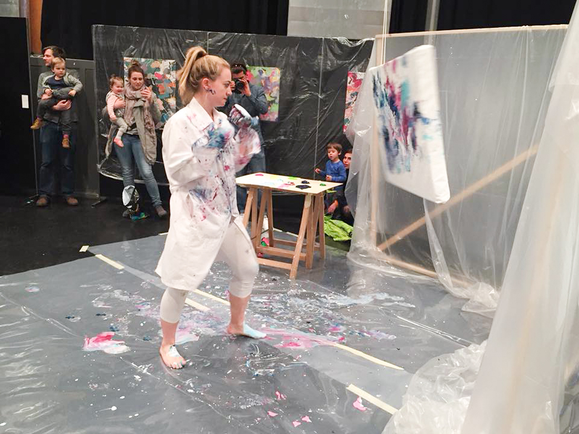
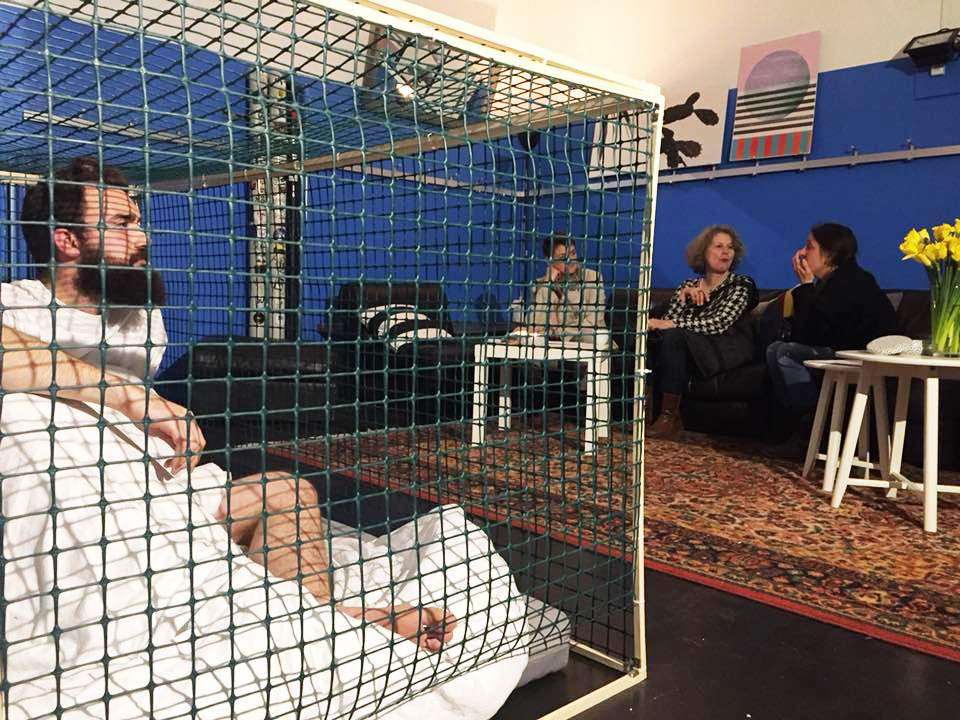

## JKON 2018

__Kuratorinnen__: Tanja Breu, Antonella Barone

__Preisträger\*innen__: [Aramis Navarro](http://www.aramisnavarro.com/), [Yasmin Mattich](http://yasminmattich.wixsite.com/portfolio), Alizé Rose-May Monod

__Künstler\*innen__:
Alizé Rose-May Monod, Anna Marcus, [Aramis Navarro](http://www.aramisnavarro.com/), [Corina Schaltegger](http://www.corinaschaltegger.ch/), [Fernando Obieta](https://blanktree.ch/), [Gregor Vogel](https://www.gregor-vogel.com/), [Helen Eggenschwiler](https://heleneggenschwiler.ch/), [Kaspar Flück](https://kasparflueck.com/), Kornelia Hui, Lea Meier, [Livio Beyeler](https://www.liviobeyeler.com/), Manutcher Milani, Marlijn Karsten, [Michael Reinhold](https://www.michaelreinhold.org/), Mirkan Deniz, Nina Carla Hunziker, [Sebastian Haas](https://www.sebastianhaas.ch), [Yasmin Mattich](http://yasminmattich.wixsite.com/portfolio)

## JKON 2017

__Kuratorinnen__: [Shannon Zwicker](http://www.shannonzwicker.ch/), [Andrina Keller](http://www.andrinakeller.ch/)

__Preisträger\*innen__: [Gregor Vogel](https://www.gregor-vogel.com/), [Cornelia Fröhlich](http://corneliafroehlich.com/)

__Künstler\*innen__:
[Adrian Fernandez Garcia](http://adrianfernandezgarcia.com/), [Anouk Strähl](https://www.dent-de-lion.ch/), [Cornelia Fröhlich](http://corneliafroehlich.com/), [Daniel Züsli](http://www.daniel-zuesli.ch/), Eliane Hürlimann, [Flavia Somalvico](http://flaviasomalvico.blogspot.com/), [Gregor Vogel](https://www.gregor-vogel.com/), Mathola Wittmer, [Mattania Bösiger](https://macherei.com/), Michaela Schmid, [Nadja Künzli](https://www.nadjakuenzli.ch/), [Nicolas Witschi](http://nicolaswitschi.com/), [Ramona Köchli](http://ramonakoechli.ch/), [Reto Lienhard](http://www.retolienhard.com/), [Samuel Rauber](http://www.samuelrauber.ch/), [Sonja Berta](http://www.sonjaberta.com/)

## JKON 2016

__Preisträger__: [Jan Merlin Pulfer](https://macherei.com/), [Fabian Matz](https://fabianmatz.com/), [Samuel Kunz](http://samuel-kunz.tumblr.com/)

__Künstler\*innen__:
Corina Heinrich, Daniel Müller, [Fabian Matz](https://fabianmatz.com/), [Jan Merlin Pulfer](https://macherei.com/), [Julia Nussbaumer](https://julianussbaumer.com/), [Julia Schicker](http://www.juliaschicker.ch/), [Laurie Vannaz](http://laurievannaz.wixsite.com/portfolio), [Maeva Rosset](http://www.maevarosset.com/), Matthias Amsler, [Naomi Figueiredo](https://www.naomifigueiredo.com/), [Nico Sebastian Meyer](http://www.nicosebastianmeyer.com/), [Pearlie Frisch](https://pearliefrisch.com/), [Ruben Frei](http://rubenfrei.com/), [Sara Tordini](http://saratordini.tumblr.com/), [Samuel Kunz](http://samuel-kunz.tumblr.com/), [Selina Zürrer](http://www.selinazuerrer.ch/), [Thomas Blank](http://www.thomasgeorgblank.de/)
 

## JKON 2015

__Preisträger\*innen__: [Charlotte Friedli](https://www.charlottefriedli.com/), [Nadia Bader](http://www.nadiabader.ch/), [Roshan Adhihetty](http://www.adhihetty.ch/)

__Künstler\*innen__:
[Anna Andris-Schwindt](http://www.anna-andris.de/), Aresu Khosy, [Carol Baumgartner](http://www.carolbaumgartner.net/), [Charlotte Friedli](https://www.charlottefriedli.com/), [Janine Strasser](https://janinestrasser.allyou.net/), Manuel Guldimann, Marea Hildebrand, [Nadia Bader](http://www.nadiabader.ch/), Paloma Egger, Polina Chizhova, [Rafael Lippuner](http://artscience.uni-ak.ac.at/people/herr__rafael_lippuner), [Ronja Römmelt](https://www.zhdk.ch/person/207098), [Roshan Adhihetty](http://www.adhihetty.ch/), Simon Hofmann, [Tyrone Richards](http://tyronerichards.ch/), [Ursina Leutenegger](https://vimeo.com/user18355118), Micha Reichenbach 
